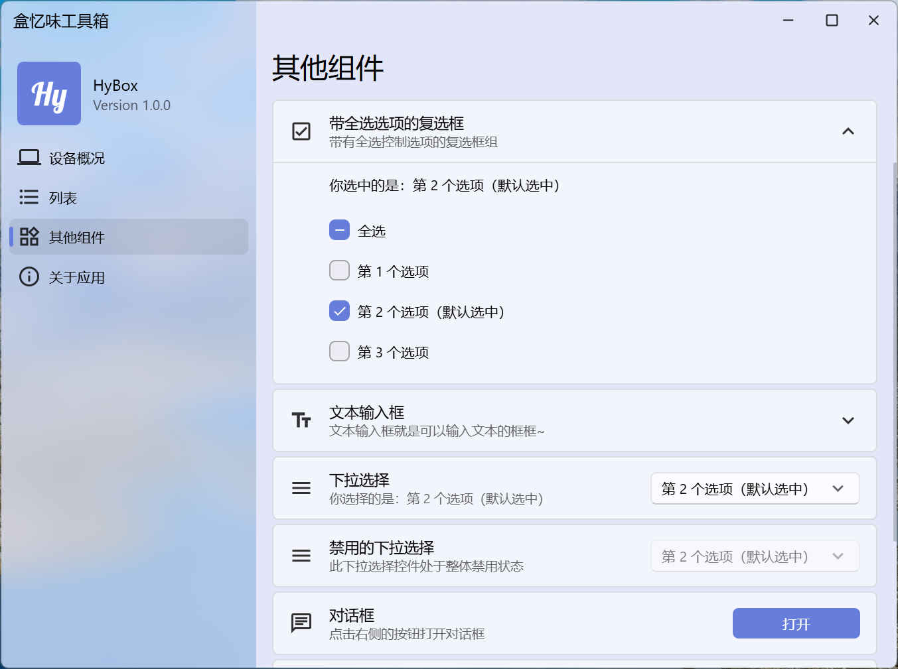
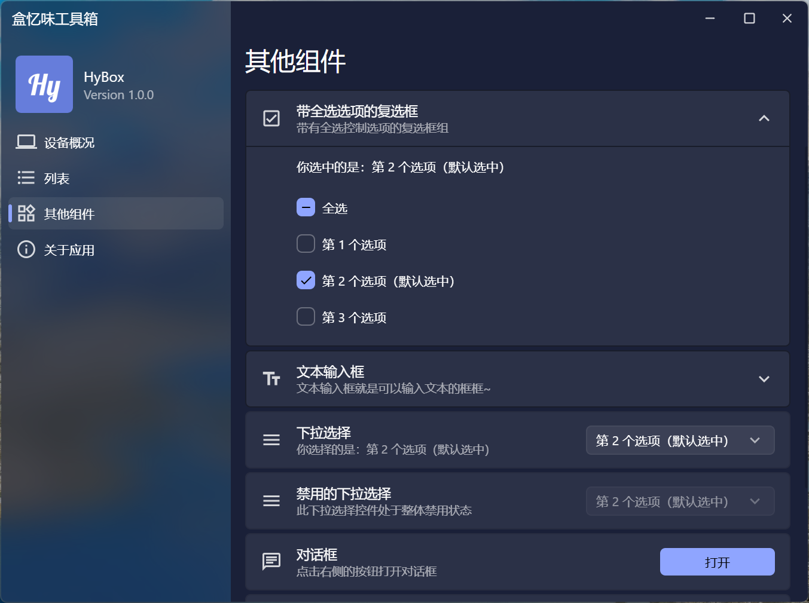

# HyBox
一个 Vue.js 与 Electron 学习实践项目，部分复刻 WinUI 3。 
（目前还没有什么实际功能）
## Demo

    
    

## To-do（也许会做吧）
- [ ] 菜单（包括上下文菜单）
- [ ] 工具提示
- [ ] 进度指示器（线性、线性加载、环形加载）
- [ ] 导航栏伪元素动画优化
## 备注
- 本应用的亚克力效果仅支持 Windows 11 操作系统。
- 个人能力有限，部分组件与原版 WinUI 3 的效果有些差异，无法完美复刻。
- 作者刚接触 Vue.js 和 Electron，某些地方写得不规范，请谅解。